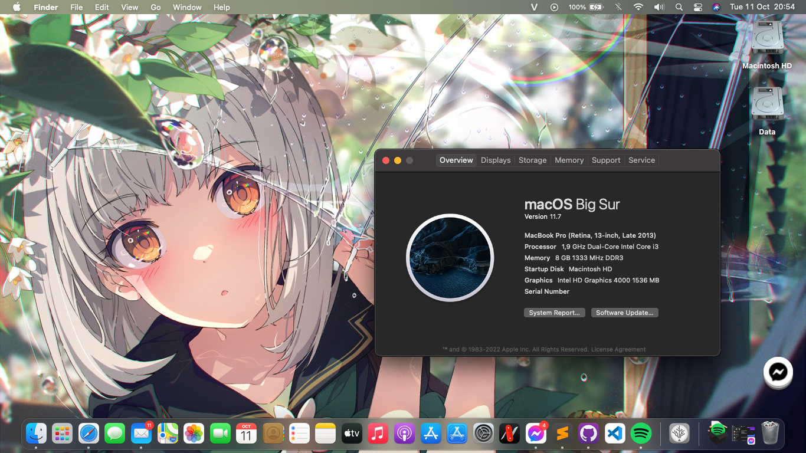
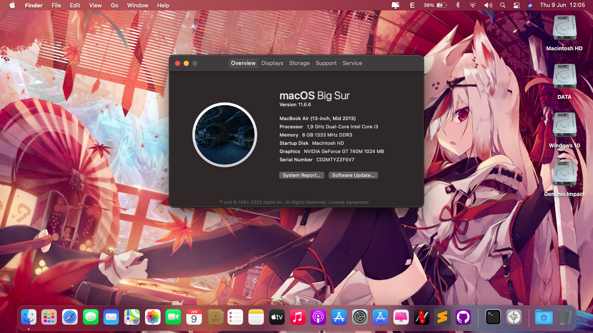
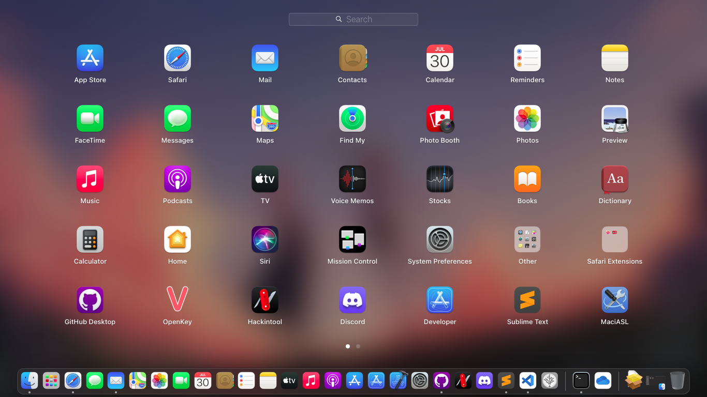
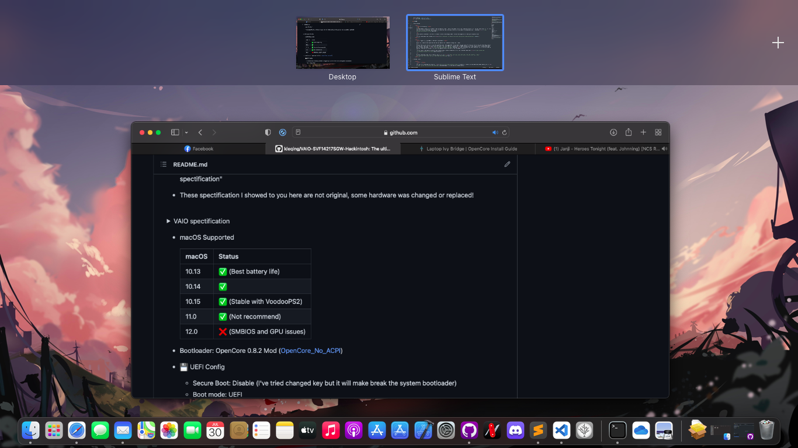
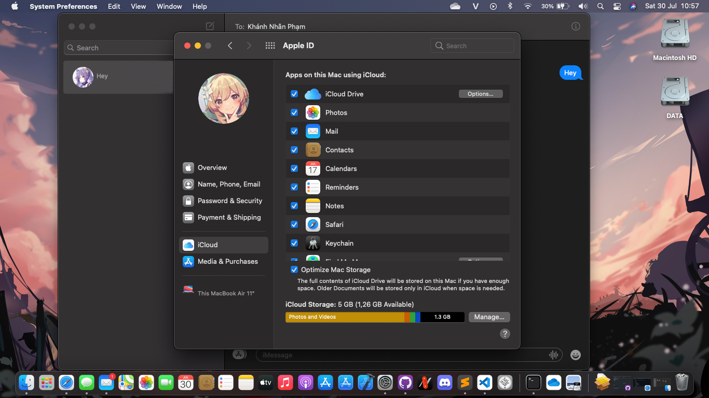
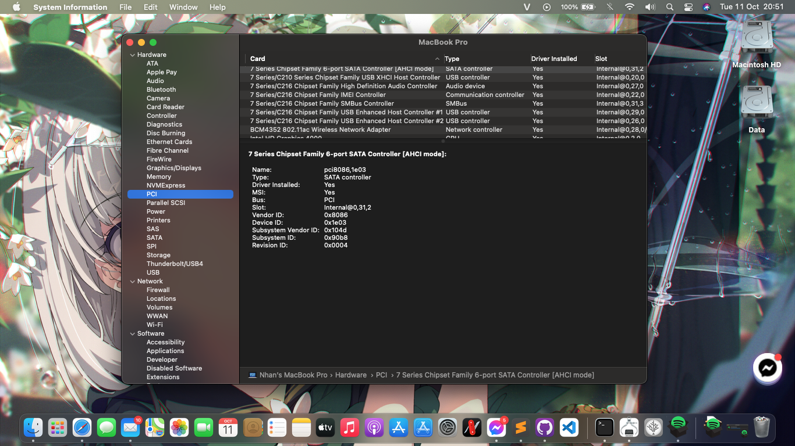

<h1 align="center">Sony VAIO SVF14217SGW Hackintosh</h1> 

<h6 align="center">Desktop preview</h6>

## Issues

* Known issues:

	

		
Dual Booting

		 
		~~For some reason, almost VAIO notebooks come from 2016 or older (I donn't sure about that!) didn't have any option in UEFI called: 'Boot Priority'. So, that mean there're many challenge come with that. To fixed this, we inly have 1 solution: Using EasyUEFI to custom boot entry! Download <a href="https://www.easyuefi.com/index-us.html">EasyUEFI</a>
		 
		 
		To add OpenCore and make it boot first instead of Windows Boot Manager (WBM). Please choose OpenCore.efi from /EFI/OC/OpenCore.efi 
		 
		For full guide about this, please read <a href="https://www.olarila.com/topic/13072-dual-boot-guide-clover-and-open-core/">here</a>~~
	

	

		
OpenCore injector

		 
		As you now, OpenCore are supported more OSes and faster than Chameleon (Legacy) and Clover!
		 
		Beside, there're also many error come with this bootloader. Like using DSDT instead SSDT. The main reason for this is there are lot of various kext support more hardware. That mean you needn't use DSDT anymore, only use SSDT and hot-patch. But the VAIO notebooks aren't! They required DDST to make macOS read their battery! (Basically, <a href="https://github.com/1Revenger1/ECEnabler">ECEnabler</a> didn't work with some VAIO notebooks, they need DSDT to read the battery). And that mean OpenCore will inject our patched DSDT to all OSes and it cause BDOS on Windows!
		 
		For more information about inject ACPI inject, you can read <a href="https://dortania.github.io/OpenCore-Install-Guide/why-oc.html#does-opencore-always-inject-smbios-and-acpi-data-into-other-oses">here</a>
	

* Known issues but cann't be fixed

	

		
Battery

		 
		DSDT now is not required for my system, <a href="https://github.com/1Revenger1/ECEnabler">ECEnabler</a> can be used to make macOS detect battery and <a href="https://github.com/acidanthera/BrightnessKeys">BrightnessKeys</a> can be used for hotkey patching.
		 
		I've tried using ECEnabler.kext and BrightnessKeys.kext for 2 months ago. Everything working fine but the battery isn't, it didn't show in the menu bar. When I pluged the AC Adapter, the battery just appeared at the same time. And that was the reason why I choose DSDT patched. For the brightness key, I just realized that if I don't put the DSDT.aml into /EFI/OC/ACPI, I can use the function key like normal. But with the battery problem, I think that sometime DSDT was the best choice than using SSDT with 'delayed' kext.
	

	* EDIT: I found the problem that can be fix by using DSDT but it's very complicated. For more details, I cann't share to you because not everyone has this problems!

## Overview

- These spectification is showing here are not original, some hardware has been changed or replaced!

💾 Laptop spectification

 

|     Name     | More infomation | 
|:-----------:|:---------------------:|
|   CPU  | Intel Core i3 3227U 1.90 GHz |
|   GPU   | Intel HD Graphics 4000 | 
|  dGPU | NVIDIA GeForce GT 740M |
| Memory | 1333MHz DDR3 2x4GB |
| Audio | Realtek ALC 233 |
| Ethernet | Realtek RTL 8111 |
| Card Reader | RTS5209 |
| Wifi | BCM94352HMB |
| Hard Disk Drive | Netac SSD 256GB |
| Second Disk Drive | HGST 500GB |

 

💻 Which macOS does this EFI supported for?

 

|     macOS     | Status | 
|:-----------:|:---------------------:|
|   10.13  | ✅ |
|   10.14   | ✅ | 
|  10.15 | ✅ |
| 11.0 | ✅ |
| 12.0 | ❌ (SMBIOS and GPU issues) |

 

 
🛠 UEFI Config

	 Secure Boot: Disable (Please don't tried to replace the secure boot key. It might break the system bootloader) 
	Boot mode: UEFI 
	1st boot priority: External Device 
	External boot device: Enable 
	Wake on LAN: Unsupported 

- Current Status
	| Feature | Status | Note |
	| ------------- | ------------- | ------------- | 
	| CPU | ✅ | |
	| GPU | ✅ | |
	| dGPU | ❌ | Can be turned off via SSDT |
	| Fn Key | ✅ | |
	| Brightness | ✅ | |
	| USB Port | ✅ | |
	| Audio | ✅ | Add `alcid=27` to boot-arg or add layout-id to DeviceProperties |
	| Battery | ✅ | |
	| TouchPad | ✅ | Recommend using 2.2.4 for compatibility issues |
	| Build-in Microphone | ✅ | |
	| Headphone & Speaker | ✅ | |
	| Camera | ✅ | It work but my camera has been broken |
	| Wifi & Bluetooth | ✅ | Need to replace |
	| Airdrop & Handoff | ✅ | Required wifi card support bluetooth 4.0 |
	| iMessage, Facetime & AppStore | ✅| |
	| Sleep | ✅ | |
	| HDMI |  ✅ | |
	| SD Card | ✅ | Although Windows show at RTS5208 but macOS still detect RTS5209! |
	| WWAN | ❌ | |
	| NFC | ❌ | |
	| FileVault | ⚠️ | Untested |
	| DRM | ⚠️ | Untested |

- Bootloader: OpenCore 0.8.6 (No ACPI)

## Changelog

- 11/10/2022 (0.8.6)
	* NEW DSDT: Rename EC0, BAT1 (this computer only have 1 battery), detele unused device.
	* For more stable while using hack, <a href="https://github.com/CloverHackyColor/FakeSMC3_with_plugins">FakeSMC3</a> now will use with this EFI.
	* Update kext to lastest version, Update OC to 0.8.6.
	* Add PCIe port to config.plist.
	* Change smbios to Macbook Pro.
	* Add new SSDT-PLUG and new power management kext (CPUFriend(Friend)). Now you can change smbios to newer version without lossing PM.
	* Remove unused patch and kext.
	* Fix HDMI output problems.
	* Add Inject EDID, now you can choose more resolution for your mac!
	* Fix double wake at lid when computer sleep.

## Attention

- Some feature are not working correctly. Please report to me if you found any issues that didn't working.
- Please change the SMBIOS in my config.plist to your SMBIOS. You can use <a href="https://github.com/corpnewt/GenSMBIOS">GenSMBIOS</a>
- I didn't tested this EFI in Monterey. If you want to tried this, please add `-no_compat_check` or change SMBIOS to `MacBookPro11,4` (Recommended). You can fix the graphics card (HD 4000) by using OCLP (Required disable SIP)

## Preview

Quick look

 

 

 

 

 

## Credits

- <a href="apple.com">Apple</a> for macOS.
- Acidanthera, Mieze, USBToolBox, etc. for all the kext
- Rehabman for the patched DSDT file
