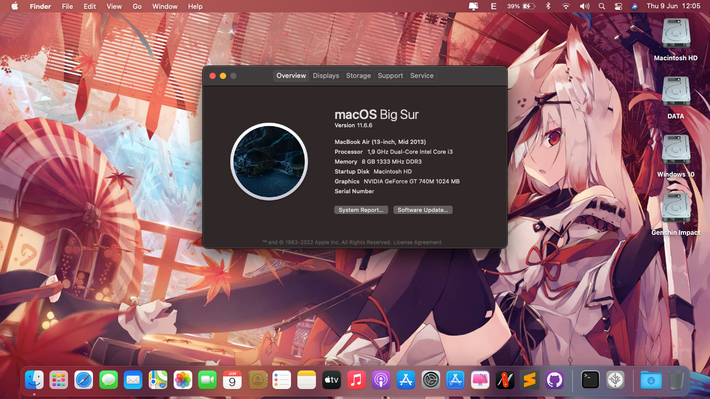

<h1 align="center">Sony VAIO SVF14217SGW Hackintosh</h1> 

<h6 align="center">Desktop preview</h6>

## Issues

* Known issues:

	

		
Dual Booting

		 
		For some reason, almost VAIO notebooks come from 2016 or older (I donn't sure about that!) didn't have any option in UEFI called: 'Boot Priority'. So, that mean there're many challenge come with that. To fixed this, we inly have 1 solution: Using EasyUEFI to custom boot entry! Download <a href="https://www.easyuefi.com/index-us.html">EasyUEFI</a>
		 
		 
		To add OpenCore and make it boot first instead of Windows Boot Manager (WBM). Please choose OpenCore.efi from /EFI/OC/OpenCore.efi 
		 
		For full guide about this, please read <a href="https://www.olarila.com/topic/13072-dual-boot-guide-clover-and-open-core/">here</a>
	

	

		
OpenCore inject DSDT and BDOS issue on Windows

		 
		As you now, OpenCore are supported more OSes and faster than Chameleon (Legacy) and Clover!
		 
		Beside, there're also many error come with this bootloader. Like using DSDT instead SSDT. The main reason for this is there are lot of various kext support more hardware. That mean you needn't use DSDT anymore, only use SSDT and hot-patch. But the VAIO notebooks aren't! They required DDST to make macOS read their battery! (Basically, <a href="https://github.com/1Revenger1/ECEnabler">ECEnabler</a> didn't work with some VAIO notebooks, they need DSDT to read the battery). And that mean OpenCore will inject our patched DSDT to all OSes and it cause BDOS on Windows! 
		 
		Luckily, Olarila have make a version to make OpenCore didn't inject patched DSDT to all OSes. You can check this: <a href="https://github.com/OlarilaHackintosh/OpenCore_NO_ACPI">OpenCore_No_ACPI</a>
		 
		 
		For more information about inject ACPI inject, you can read <a href="https://dortania.github.io/OpenCore-Install-Guide/why-oc.html#does-opencore-always-inject-smbios-and-acpi-data-into-other-oses">here</a>
	

* Unknown issues

	

		

		 
		DSDT now is not required for my system, <a href="https://github.com/1Revenger1/ECEnabler">ECEnabler</a> can be used to make macOS detect battery and <a href="https://github.com/acidanthera/BrightnessKeys">BrightnessKeys</a> can be used for hotkey patching.
		 
		I've tried using ECEnabler.kext and BrightnessKeys.kext for 2 months ago. Everything working fine but the battery isn't, it didn't show in the menu bar. When I pluged the AC Adapter, the battery just appeared at the same time. And that was the reason why I choose DSDT patched. For the brightness key, I just realized that if I don't put the DSDT.aml into /EFI/OC/ACPI, I can use the function key like normal. But with the battery problem, I think that sometime DSDT was the best choice than using SSDT with 'delayed' kext.
	

## Overview

- These spectification is showing here are not original, some hardware has been changed or replaced!
 

Laptop spectification

 

|     Name     | More infomation | 
|:-----------:|:---------------------:|
|   CPU  | Intel Core i3 3227U 1.90 GHz |
|   GPU   | Intel HD Graphics 4000 | 
|  dGPU | NVIDIA GeForce GT 740M |
| Memory | 1333MHz DDR3 2x4GB |
| Audio | Realtek ALC 233 |
| Ethernet | Realtek RTL 8111 |
| Wifi | BCM94352HMB |
| Hard Disk Drive | Netac SSD 256GB |
| Second Disk Drive | HGST 500GB |

- macOS Supported
 	| macOS | Status |
	| ------- | -------- | 
	| 10.13 | ✅ | 
	| 10.14 | ✅ | 
	| 10.15 | ✅ | 
	| 11.0 | ✅ |
	| 12.0 | ❌ (SMBIOS and GPU issues) |  

- Bootloader: OpenCore 0.8.2 Mod (<a href="https://www.olarila.com/topic/24542-opencore_no_acpi-opencore-with-additional-featureschanges-implemented-how-to-use-this-fork/">OpenCore_No_ACPI</a>)

- 💾 UEFI Config
	* Secure Boot: Disable (I've tried changed secure boot key but it might break the system bootloader)
	* Boot mode: UEFI
	* 1st boot priority: External Device
	* External boot device: Enable
	* Wake on LAN: Unsupported

- Current Status
	| Feature | Status | Note |
	| ------------- | ------------- | ------------- | 
	| CPU | ✅ | |
	| GPU | ✅ | |
	| dGPU | ❌ | Can be turned off via SSDT |
	| Fn Key | ✅ | |
	| Brightness | ✅ | |
	| USB Port | ✅ | |
	| Audio | ✅ | Add `alcid=27` to boot-arg or add layout-id to DeviceProperties |
	| Battery | ✅ | |
	| TouchPad | ✅ | Recommend using 2.2.4 for compatibility issues|
	| Build-in Microphone | ✅ | |
	| Headphone & Speaker | ✅ | |
	| Camera | ✅ | |
	| Wifi & Bluetooth | ✅ | Need to replace |
	| Airdrop & Handoff | ✅ | Required wifi card support bluetooth 4.0 |
	| iMessage, Facetime & AppStore | ✅| |
	| Sleep | ✅ | |
	| HDMI |  ✅ | |
	| SD Card | ❌ | Can turn off by using SSDT to save battery |
	| WWAN | ❌ | |
	| FileVault | ⚠️ | Untested |
	| DRM | ⚠️ | Untested |

## Changelog

- 06/10/2022
	* Release with OC Mod 0.8.1, all kext are up to date

- 07/05/2022
	* Bump OC to 0.8.2 (Moded)
	* Fix DSDT issues (SMBUS, RTC, etc.)
	* Clean boot arg
	* Update kext
	* Use FakeSMC instead of VirtualSMC to make macOS detected battery better
	* Fixed boot loop with HDMI port
	* Fixed Power management
	* Add new feature: Enable TRIM without use terminal to force enable

- 07/30/2022
	* NEW: Now you can rename CPU via `/config.plist/NVRAM/4D1FDA02-38C7-4A6A-9CC6-4BCCA8B30102/revcpuname`. Added memory tab in 'About this mac'. Also you can rename your GPU via `/config.plist/DeviceProperties/PciRoot(0x0)/Pci(0x2,0x0)/model`.
	* Brand new DSDT: Fix battery always show as 'Power Adaper', remove iGPU patched to fix broken Finder (11.6.8) and DRM issues. Fix macOS always get delayed to sleep.
	* Downgrade VoodooPS2 from 2.2.9 to 2.2.4 to make system booting better (No more issues with VoodooPS2 when booting)
	* Remove unnecessary patched in `/config.plist/ACPI/patched`. Add USB renamed patched to fix sleep issues.  
	* Add SSDT-USB-Reset.aml for USB renamed. Added SSDT-PM.aml, SSDT-PNLF.aml and SSDT-EC.aml. EC, PNLF and PM has been removed in DSDT to make system working better.
	* Update all kexts to lastest version (except VoodooPS2)
	* Fix HDMI conX issues. Remove framebuffer-conx-pipe in `DeviceProperties` because my hacks didn't reboot when hdmi is pluged-in. Added support HDMI 2.0.
	* Add boot-arg to support Sidecar on old iPad, allow rename CPU and bootloop problem with Big Sur
	* VirtualSMC now be used for this version.

## Attention

- Some feature are not working correctly. Please report to me if you found any issues that didn't working.
- Please change the SMBIOS in my config.plist to your SMBIOS. You can use <a href="https://github.com/corpnewt/GenSMBIOS">GenSMBIOS</a>
- I didn't tested this EFI in monterey. If you want to tried this, please add `-no_compat_check` or change SMBIOS to `MacBookPro11,4` (Recommended). You can fix HD 4000 by using OCLP (Required disable SIP)

## Preview

Quick look

 

 

 

 

## Credits

- <a href="apple.com">Apple</a> for macOS.
- Acidanthera, Mieze, USBToolBox, etc. for all the kext
- Rehabman for the patched DSDT file
- Olarila for Bootloader