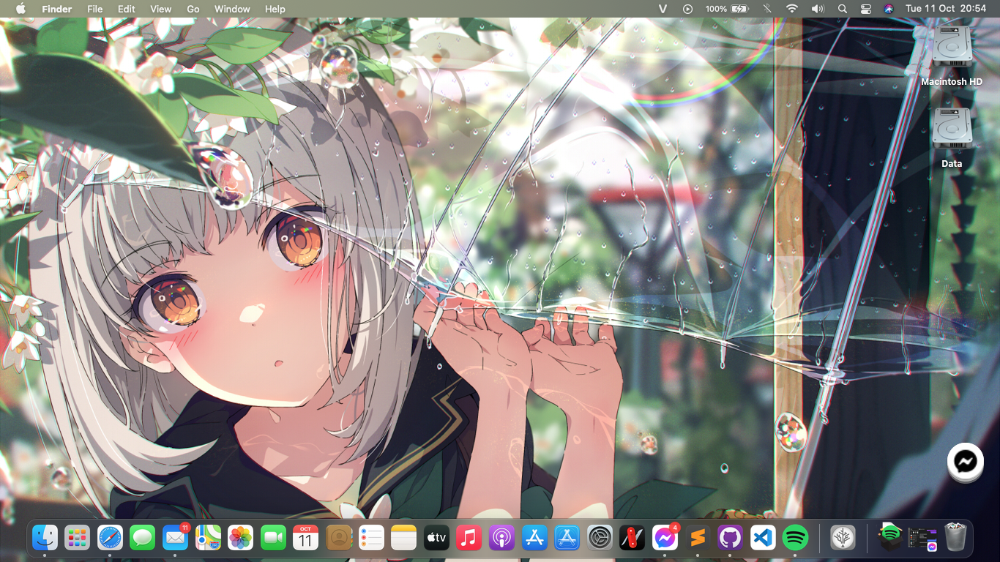

# SVF14217SGW Hackintosh

## Attention: Please read all the issues I wrote here before you use this EFI!
May you will asked why should you read all of the issues here. The answer is:
- The VAIO notebooks series are the hardest notebook to Hackintosh. The main reason is it didn't support 'Boot Priority' in UEFI!
- Required DSDT to patch to make some hardware working, not SSDT (except: GPU, etc.)

* Issues:
	

		
Dual Booting

		For some reason, almost VAIO notebooks come from 2016 or older (I donn't sure about that!) didn't have any option in UEFI called: 'Boot Priority'. So, that mean there're many challenge come with that. To fixed this, we inly have 1 solution: Using EasyUEFI to custom boot entry! Download <a href="https://www.easyuefi.com/index-us.html">EasyUEFI</a>
		To add OpenCore and make it boot first instead of Windows Boot Manager (WBM). Please choose OpenCore.efi from /EFI/OC/OpenCore.efi. For full guide, please read <a href="https://www.olarila.com/topic/13072-dual-boot-guide-clover-and-open-core/">here.</a>
	

	

		
OpenCore DSDT and BDOS on Windows

		As you now, OpenCore is my favourite bootloader because:
			- Support more OSes
			- Faster booting than Chameleon (Legacy) and Clover
			- And more...
		Beside, there're also many error come with this bootloader. Like using DSDT instead SSDT. The main reason for this is there are lot of various kext support more hardware. That mean you needn't use DSDT anymore, only use SSDT and hot-patch. But the VAIO notebooks aren't! They required DDST to make macOS read their battery! And that mean OpenCore will inject our patched DSDT to all OSes and it cause BDOS on Windows! Luckily, Olarila have make a version to make OpenCore didn't inject patched DSDT to all OSes. You can check this: <a href="https://github.com/OlarilaHackintosh/OpenCore_NO_ACPI">OpenCore_No_ACPI</a>. For more info about inject ACPI inject, you can read <a href="https://dortania.github.io/OpenCore-Install-Guide/why-oc.html#does-opencore-always-inject-smbios-and-acpi-data-into-other-oses">here.</a>
		The following kernel logs are dumped from a Coffee Lake laptop when a user changes the brightness from the lowest level to the highest one.  
		Since the distance to the next level is long, we use `N = 35` and `T = 7`,

	

